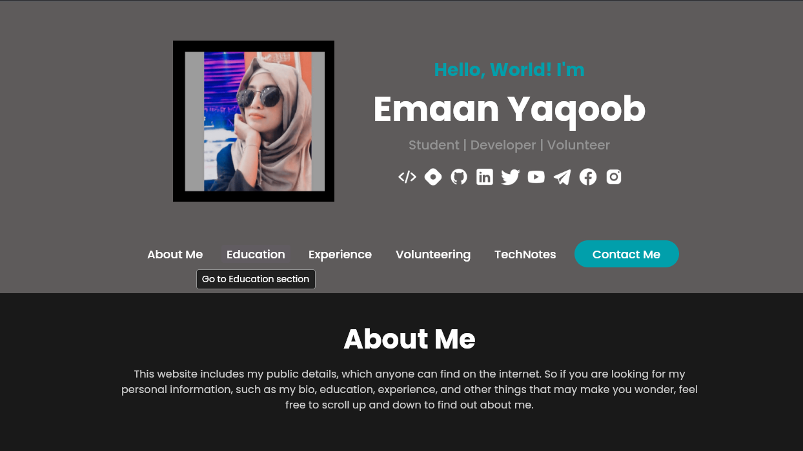

# web_protfolio

A new Flutter project.

## Getting Started

This project is a starting point for a Flutter application.

A few resources to get you started if this is your first Flutter project:

- [Lab: Write your first Flutter app](https://docs.flutter.dev/get-started/codelab)
- [Cookbook: Useful Flutter samples](https://docs.flutter.dev/cookbook)

For help getting started with Flutter development, view the
[online documentation](https://docs.flutter.dev/), which offers tutorials,
samples, guidance on mobile development, and a full API reference.
## 💙 Built With

- [Flutter](https://flutter.dev)
    - Flutter 3.7.9 • channel stable
    - Tools • Dart 2.19.6 • DevTools 2.20.1
- [GitHub Pages](https://pages.github.com)

## 📌 Prerequisites

- Setup [Flutter](https://flutter.dev) in the development environment.
- Setup a code editor like [Android Studio](https://developer.android.com/studio) or [Visual Studio Code](https://code.visualstudio.com) in the development environment.
- Setup [Git](https://git-scm.com) in the development environment.
- Should be fine with the `flutter doctor` command.
- Anything related to the Flutter app development.

## 💡 How to Setup

- Download or clone the repository.
- Move the project to the selected directory.
- Open it with a code editor such as [Android Studio](https://developer.android.com/studio) or [Visual Studio Code](https://code.visualstudio.com).
- Run `flutter clean` and `pub get` commands.
- **Do not update or upgrade Gradle and other versions until the app is up and running with built versions.**

## 🚀 How to Run

- Download `web-build` directory from the [web-build](https://github.com/eeimaan/web_protfolio) branch.
- Move the build files to a server such as `localhost`, `GitHub Pages`, or any other `http/https` web server.
- Set up and run the `index.html` file.

## 🖼️ Icons and Images

- [Icons8](https://icons8.com)

## 💎 Dependencies

- [Flutter](https://flutter.dev)/[Dart](https://dart.dev): Environment SDK: `>=2.19.2 <3.0.0`
- [Cupertino Icons](https://pub.dev/packages/cupertino_icons): `^1.0.2`
- [URL Launcher](https://pub.dev/packages/url_launcher): `^6.1.9`
- [Flutter Native Splash](https://pub.dev/packages/flutter_native_splash): `^2.2.17`

## project snap
